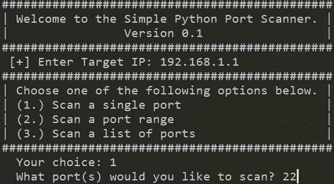
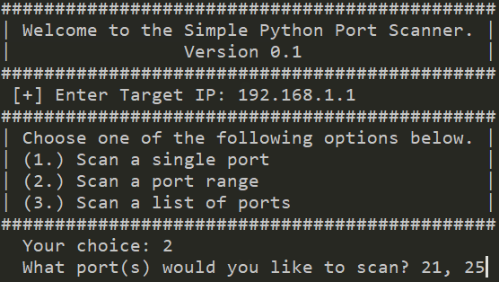
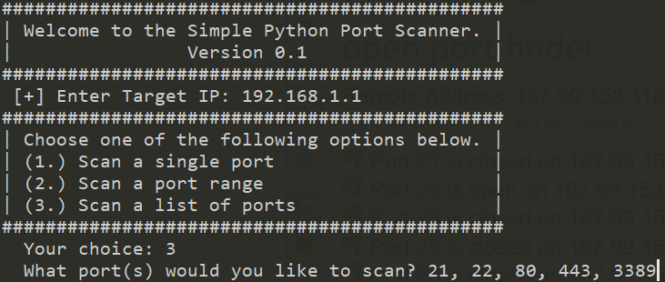

# port-scan
A small tool to scan for open ports on a particular IP address

### Scan a single port

### Scan a port range

### Scan a specific list of ports
Still under construction! :construction:
